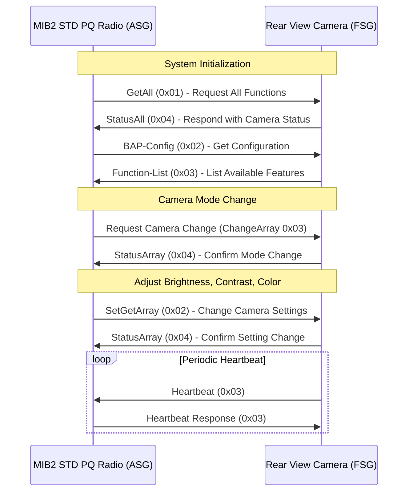

# BAP Protocol Reverse Engineering

 **GitHub Discussions Now Open! Join the Research!** 🚀  
We’ve enabled **GitHub Discussions** to collaborate on BAP protocol decoding!  
- Share **CAN traces**
- Ask **questions about PQ/MQB platforms**
- Contribute to **multi-frame handling research**
- 
 **Much more data is on the way!**  
I’m actively formatting and organizing my research, so expect new **function mappings, message breakdowns, and analysis updates soon!**

##

Documentation and analysis of **Bedien-und Anzeigeprotokoll (BAP)**, reverse-engineered for PQ and MQB platforms. Includes protocol specifications, CAN traces, and behavioral observations. This research supports development of open-source libraries for interfacing with BAP-enabled ECUs.


## Protocol Overview

BAP (Control and Display Protocol) manages ECU communication in Volkswagen Group vehicles, succeeding DDP (Diagnostic Data Protocol). Key features:

- **Event-driven architecture**: Reduces bus load vs constant polling
- **Standardized messaging**: Fixed header with variable payload
- **Multi-platform support**: PQ and MQB implementations
- **Error resilience**: Automatic retransmission and state synchronization
- **Multi-frame support** for messages >6 bytes


## Acronyms & Definitions
- **BAP** – Bedien- und Anzeigeprotokoll (Control & Display Protocol)
- **DDP** – Display Data Protocol (Predecessor to BAP)
- **CAN** – Controller Area Network (Vehicle communication bus)
- **FSG** – Funktionsteuergerät (Function Control Unit) → Sends data
- **ASG** – Anzeigesteuergerät (Display Control Unit) → Receives data
- **LSG** – Logical Service Group (Groups related functions)
- **FCT** – Function ID (Identifies a specific BAP function)
- **MSB/LSB** – Most Significant Byte / Least Significant Byte
- **ECU** – Electronic Control Unit (A vehicle's embedded controller)
 
## Platform Implementations

### PQ Platform
**CAN 2.0A** implementation with 11-bit identifiers:
```plaintext
┌───────────────┬──────────────┬─────────────────┐
│ 11-bit CAN ID │   DLC (4b)   │   Payload (8B)  │
├───────────────┼──────────────┼─────────────────┤
│   0x123       │     8        │ 01 03 0A 00 05. │
└───────────────┴──────────────┴─────────────────┘
```

### Message Architecture (PQ)

#### Multi-Frame Handling
PQ platforms use the first bit of the message to determine frame type:

1. **Short Frame (≤6 bytes)**
   
```plaintext
Byte 0 (First byte of message):
┌─┬───────────┐
│0│OP Code    │ ◄── First bit 0 indicates Short Frame
└─┴───────────┘

Complete Frame Structure:
┌────────────┬────────────┬──────────────────────┐
│First Byte  │Second Byte │   Payload (0-6 B)    │
│[0|OP Code] │[LSG|FCT]   │                      │
└────────────┴────────────┴──────────────────────┘
```

2. **Long Frame (>6 bytes)**
```plaintext
**Long Frame Structure**

Preamble Byte 0 (Bit Layout):

┌─┬─┬──────────┐
│1│S│  Index   │
└─┴─┴──────────┘
 │ │    │
 │ │    └── 6 bits: Frame index (starts at 0)
 │ └──── Frame type (0=Start frame, 1=Continuation)
 └────── Always 1 for Long Frame
```

Start Frame (S=0):
```plaintext
┌────────────┬────────────┬────────────┬─────────────┐
│Preamble B0 │Preamble B1 │BAP Header  │Payload      │
│[1|0|Index] │[Total Len] │[LSG|FCT]   │(up to 6 B)  │
└────────────┴────────────┴────────────┴─────────────┘

Continuation Frame (S=1):
┌────────────┬─────────────────────────────────┐
│Preamble    │           Payload               │
│[1|1|Index] │         (up to 7 B)             │
└────────────┴─────────────────────────────────┘
```

**Sequence Control**:
- Initial sequence marker: 0x80 (10000000 binary)
- Continuation Index starts at: 0xC0 (11000000 binary)


## BAP Startup Handshake (PQ Platform)
During initialization, the Function Control Unit (FSG) and Display Unit (ASG) exchange specific messages:

1. **FSG-Setup (`FCT_ID = 0x0E`)**
   - Sent by the **FSG (e.g., RVC module)** to inform the **ASG (e.g., MIB2)** that the function group is ready.


2. **FSG-OperationState (`FCT_ID = 0x0F`)**
   - Defines operational states:
     - `0x00` Normal Operation
     - `0x01` Off/Standby
     - `0x03` Initializing
     - `0x0E` Function Inactive
     - `0x0F` Defective

3. **BAP-Config (`FCT_ID = 0x02`)**
   - Provides protocol version and supported function list.

4. **Function-List (`FCT_ID = 0x03`)**
   - ECU tells the ASG which features it supports.

5. **GetAll / StatusAll**
   - The ASG requests all function values, the ECU replies.


### MQB Platform
Extended 29-bit identifiers with embedded LSG addressing:
```plaintext
┌──────────────┬────────────┬──────────────┐
│ Base ID      │ LSG ID     │ Subsystem ID │
│ (16 bits)    │ (8 bits)   │ (5 bits)     │
└──────────────┴────────────┴──────────────┘
```

## 📌 MQB Data Source & Accuracy
Much of the MQB ID mapping information comes from **Drive2 (User: VanHighlander)**.  
⚠️ **Accuracy is still being verified**—some IDs may not be correct or might behave differently depending on vehicle configuration.  

If you can **confirm, correct, or expand** on any of this data, please share your findings or submit a Pull Request!

---
## Climatronic Control (HVAC)
| **CAN ID**        | **Function Name**           | **Description** |
|-------------------|---------------------------|----------------|
| `0x17330100` | `Klima1 ASG` | Climate Control (ASG - MIB2) |
| `0x17330200` | `Klima2 ASG` | Climate Control (Secondary ASG) |
| `0x17330110` | `Klima1 FSG` | Climate Control (FSG - HVAC ECU) |
| `0x17330210` | `Klima2 FSG` | Climate Control (Secondary FSG) |

---
## Seat Controls & Memory Functions
| **CAN ID**        | **Function Name**           | **Description** |
|-------------------|---------------------------|----------------|
| `0x17331000` | `Sitz ASG` | Seat Control (ASG - MIB2) |
| `0x17331010` | `Sitz FSG` | Seat Control (FSG - Seat Module) |

---
## Unit & Cluster Settings
| **CAN ID**        | **Function Name**           | **Description** |
|-------------------|---------------------------|----------------|
| `0x17331300` | `Einheiten ASG` | Unit Settings (ASG - MIB2) |
| `0x17331310` | `Einheiten FSG` | Unit Settings (FSG - Cluster) |

---
## Exterior Lighting
| **CAN ID**        | **Function Name**           | **Description** |
|-------------------|---------------------------|----------------|
| `0x17330900` | `Aussenlicht ASG` | Exterior Lighting (ASG - MIB2) |
| `0x17330910` | `Aussenlicht FSG` | Exterior Lighting (FSG - Body Control Module) |

##  Interior Lighting 
| **CAN ID**        | **Function Name**           | **Description** |
|-------------------|---------------------------|----------------|
| `0x17330800` | `Innenlicht ASG` | Exterior Lighting (ASG - MIB2) |
| `0x17330810` | `Innenlicht FSG` | Exterior Lighting (FSG - Body Control Module) |


##  Traffic Sign Assist (VZA)
| **CAN ID**        | **Function Name**           | **Description** |
|-------------------|---------------------------|----------------|
| `0x17332100` | `VZA ASG` | Traffic Sign Recognition (ASG) |
| `0x17332110` | `VZA FSG` | Traffic Sign Recognition (FSG) |

---
## Lane Assist
| **CAN ID**        | **Function Name**           | **Description** |
|-------------------|---------------------------|----------------|
| `0x17331A00` | `SWA ASG_01` | Lane Assist (ASG - Cluster) |
| `0x17331A01` | `SWA ASG_02` | Secondary Lane Assist (ASG - MIB2) |
| `0x17331A10` | `SWA FSG` | Lane Assist (FSG - ECU) |

---
## Parking Sensors & Rear View Camera
| **CAN ID**        | **Function Name**           | **Description** |
|-------------------|---------------------------|----------------|
| `0x17330A00` | `OPS ASG` | Parking Sensors (ASG - MIB2) |
| `0x17330A10` | `OPS FSG` | Parking Sensors (FSG - PDC ECU) |
| `0x17330B00` | `RVC ASG` | Rear View Camera (ASG - MIB2) |
| `0x17330B10` | `RVC FSG` | Rear View Camera (FSG - RVC Module) |

---
## Webasto Heating System
| **CAN ID**        | **Function Name**           | **Description** |
|-------------------|---------------------------|----------------|
| `0x17330300` | `Webasto ASG` | Webasto Mode Control (ASG - MIB2) |
| `0x17330310` | `Webasto FSG` | Webasto Mode Control (FSG - Webasto ECU) |

---
## Time & Date Synchronization
| **CAN ID**        | **Function Name**           | **Description** |
|-------------------|---------------------------|----------------|
| `0x17331100` | `TimeDate ASG 01` | Time & Date Sync (ASG - MIB2) |
| `0x17331110` | `TimeDate FSG 01` | Time & Date Sync (FSG - Cluster) |

---
## Power Rear Gate
| **CAN ID**        | **Function Name**           | **Description** |
|-------------------|---------------------------|----------------|
| `0x17331F10` | `RGS FSG 01` | Power Rear Gate (FSG - Rear ECU) |
| `0x17331F00` | `RGS ASG 01` | Power Rear Gate (ASG - MIB2) |


## Research Status

### Under Investigation (PQ Platform)
1. - Startup handshake

### Under Investigation (MQB Platform)
1. **Multi-frame Protocol**
   - Frame sequencing
   - Error recovery mechanisms
   - Multi-frame handling

## Contributing

### Priority Research Areas
1. MQB Time/Date (0x17331110) testing
2. Multi-frame message handling differences


### Submission Guidelines
1. Maintain clear platform separation (PQ/MQB)
2. Include CAN traces for validation
3. Document test conditions and hardware setup
4. Please see my example traces

## Safety
- Use bench testing setups
- Please don't drive and CAN trace

## License
This project is licensed under the MIT License - see the LICENSE file for details.

## Research Acknowledgments
- Karl Dietmann's BAP research (2009-2012) 
- kisim project (BSD-3) https://github.com/tmbinc/kisim
- revag-bap contributors (GPLv2) https://github.com/norly/revag-bap/
